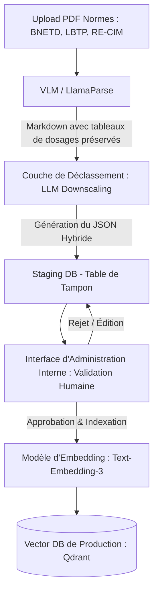
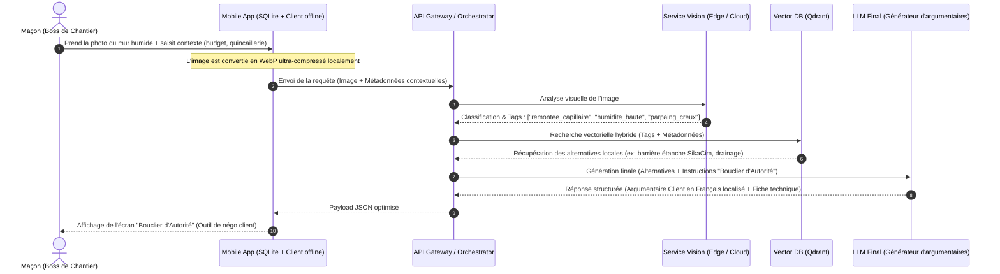
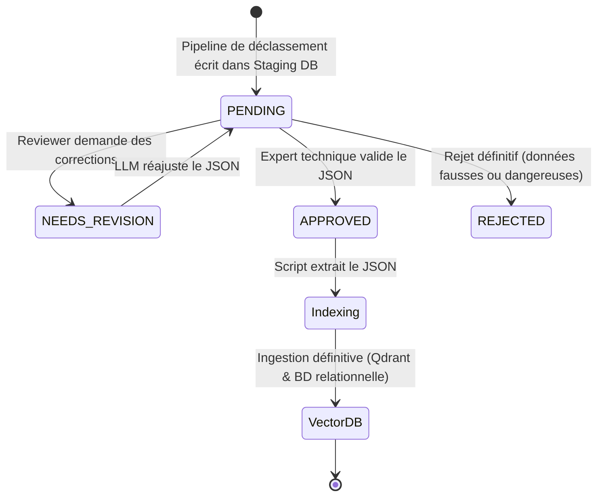
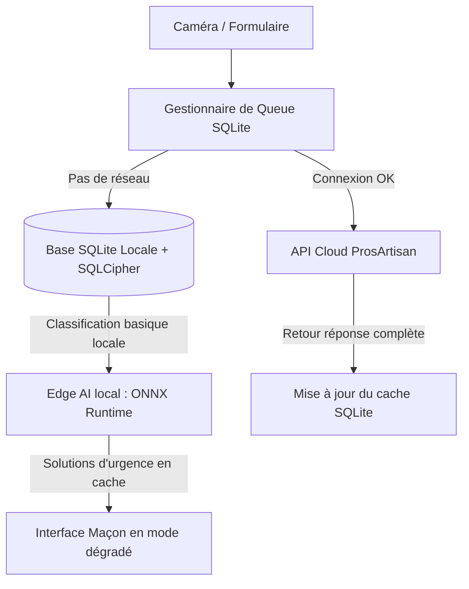

# Architecture Technique & Workflows : Assistant Visuel Intelligent pour ProsArtisan (Côte d'Ivoire)

Ce document décrit l'architecture de l'**Assistant Visuel Intelligent** conçu pour la marketplace **ProsArtisan**. Son but est d'accompagner les maçons de l'économie informelle ivoirienne ("Boss" de chantier) en leur fournissant un **"bouclier d'autorité"** technique et visuel face à des clients méfiants, tout en proposant des recommandations basées exclusivement sur des matériaux et méthodes disponibles localement.

---

## 1. Contexte Sociologique et Réalités Locales (Yopougon / Koumassi)

Le succès de cette application repose sur la prise en compte de la psychologie des acteurs locaux et des contraintes d'approvisionnement :

*   **Le "Bouclier d'Autorité" (Non-paternalisme) :** L'assistant ne doit jamais corriger ou infantiliser le "Boss". Il doit agir comme un outil de validation de son expertise. En cas d'erreur de dosage ou de méthode constatée, l'assistant présente l'alternative comme une "recommandation de conformité pour le client" afin de justifier un devis réaliste (ex: justifier l'achat de ciment CPJ 42.5 plutôt que du CPJ 32.5 pour une dalle).
*   **Disponibilité Réelle des Matériaux :** Pas de recommandations de produits importés introuvables. Les solutions reposent sur :
    *   **Ciments locaux :** CPJ 32.5 (pour maçonnerie classique, enduits) et CPJ 42.5 (pour structures porteuses, poteaux, dalles) de marques locales (CIMAF, LafargeHolcim, Dangote, SOCIM).
    *   **Adjuvants et étanchéité :** SikaCim (hydrofuge de masse omniprésent dans les quincailleries de Yopougon, Koumassi, Abobo), Super Sikalite, ou membranes bitumineuses standards.
    *   **Agrégats :** Sable de lagune (souvent trop fin/salé, nécessitant un lavage ou correction) et sable de carrière, gravier 15/25.

---

## 2. Exigence Architecturale 1 : Le Pipeline d'Ingestion Sémantique Localisé (PISL)

Le PISL résout le problème de l'inadéquation entre les normes institutionnelles (BNETD, LBTP, Eurocodes) conçues pour des chantiers industriels, et la réalité du chantier informel ivoirien.

### Schéma d'Architecture Général du PISL



### Description des Étapes du Pipeline

1.  **Extraction Table-Aware (VLM / LlamaParse) :**
    Les normes techniques de dosage (ex: ratio ciment/sable/eau) sont principalement sous forme de tableaux complexes dans les PDFs. Un parseur standard détruirait l'alignement des lignes et colonnes, rendant le dosage incohérent pour le RAG. Nous utilisons un modèle de vision de document (VLM) ou LlamaParse configuré en mode `PARSE_AND_RENDER` pour extraire ces structures en Markdown natif (`| Dosage | Ciment | ... |`).
2.  **Couche de Déclassement (Downscaling LLM) :**
    Un agent LLM (ex: Gemini 1.5 Pro ou GPT-4o) reçoit le Markdown brut et applique des règles de traduction pragmatique.
    *   *Exemple d'entrée brute :* "Le béton de fondation doit être malaxé mécaniquement en bétonnière pendant minimum 3 minutes avec du ciment CEM I 52.5..."
    *   *Traduction déclassée :* "Gâchage manuel rigoureux sur aire propre (plaque de tôle ou béton propre) pour éviter le mélange avec la terre. Utilisation de ciment CPJ 42.5 avec ajout d'un hydrofuge de masse type SikaCim (1 sachet par sac de ciment)."
3.  **Schéma JSON Hybride :**
    Chaque morceau de connaissance déclassé est structuré selon le schéma JSON strict suivant avant stockage.

### Spécification du Schéma JSON Hybride

```json
{
  "$schema": "https://json-schema.org/draft/2020-12/schema",
  "title": "ProsArtisanLocalizedStandard",
  "type": "object",
  "required": [
    "id",
    "norme_origine",
    "alternative_prosartisan",
    "cout_estime_local",
    "metadata"
  ],
  "properties": {
    "id": {
      "type": "string",
      "format": "uuid"
    },
    "norme_origine": {
      "type": "object",
      "required": ["source", "reference_article", "titre_original", "texte_brut"],
      "properties": {
        "source": { "type": "string", "enum": ["BNETD", "LBTP", "RE-CIM", "AUTRE"] },
        "reference_article": { "type": "string" },
        "titre_original": { "type": "string" },
        "texte_brut": { "type": "string" }
      }
    },
    "alternative_prosartisan": {
      "type": "object",
      "required": ["titre_vulgarise", "methode_execution", "dosages_recommandes", "materiaux_recommandes"],
      "properties": {
        "titre_vulgarise": { "type": "string" },
        "methode_execution": { 
          "type": "string",
          "description": "Instructions étape par étape rédigées pour un gâchage/mise en œuvre manuelle sur chantier local."
        },
        "dosages_recommandes": {
          "type": "array",
          "items": {
            "type": "object",
            "required": ["element", "ratio", "unite_mesure_locale"],
            "properties": {
              "element": { "type": "string", "example": "Ciment CPJ 32.5" },
              "ratio": { "type": "string", "example": "1 sac (50kg)" },
              "unite_mesure_locale": { 
                "type": "string", 
                "enum": ["Sac", "Brouette (60L)", "Seau de maçon (10L)", "Pelle"],
                "description": "Unités physiques utilisées sur le chantier informel."
              }
            }
          }
        },
        "materiaux_recommandes": {
          "type": "array",
          "items": {
            "type": "object",
            "required": ["nom", "substitut_acceptable", "disponibilite"],
            "properties": {
              "nom": { "type": "string" },
              "substitut_acceptable": { "type": "string" },
              "disponibilite": { "type": "string", "enum": ["Quincaillerie", "Zone Industrielle", "Import"] }
            }
          }
        }
      }
    },
    "cout_estime_local": {
      "type": "object",
      "required": ["gamme_prix", "estimation_m2_fcfa", "justification_economique"],
      "properties": {
        "gamme_prix": { "type": "string", "enum": ["Faible", "Moyen", "Eleve"] },
        "estimation_m2_fcfa": { "type": "string" },
        "justification_economique": { "type": "string" }
      }
    },
    "metadata": {
      "type": "object",
      "required": ["tags_pathologies", "type_ouvrage"],
      "properties": {
        "tags_pathologies": {
          "type": "array",
          "items": { "type": "string" }
        },
        "type_ouvrage": { 
          "type": "string",
          "enum": ["Fondation", "Elevation", "Enduit", "Etancheite", "Dallage", "Poteau-Poutre"]
        }
      }
    }
  }
}
```

---

## 3. Exigence Architecturale 2 : Le Workflow Utilisateur (Vision to RAG)

### Cas d'usage : Remontée capillaire sévère sur un mur en parpaings creux de 15 cm



### Logique Séquentielle Détaillée

#### Étape A : Analyse Visuelle & Extraction de Tags
La photo du mur montrant du salpêtre ou des briques humides est envoyée au module de Vision (par exemple, un modèle de classification fine-tuné sur les pathologies du bâtiment en Afrique de l'Ouest).
*   **Résultat de l'analyse :**
    ```json
    {
      "detected_pathology": "remontee_capillaire",
      "confidence": 0.94,
      "severity": "severe",
      "substrate": "parpaing_creux_15"
    }
    ```

#### Étape B : Requête Hybride vers la Vector DB
Nous interrogeons la base de données vectorielle (Qdrant dans cet exemple) en combinant la recherche sémantique (embedding de la pathologie) et un filtrage strict par métadonnées pour correspondre aux contraintes du maçon (budget, disponibilité des matériaux).

```python
# Exemple d'implémentation de la requête hybride (Python Qdrant Client)
from qdrant_client import QdrantClient
from qdrant_client.http import models

def query_localized_knowledge(
    client: QdrantClient, 
    pathology_embedding: list[float], 
    detected_pathology: str, 
    max_budget_level: str = "Moyen"
):
    """
    Exécute une requête hybride : 
    Recherche sémantique sur l'embedding de la pathologie + 
    Filtrage dur sur la disponibilité des matériaux et le coût estimé.
    """
    search_result = client.search(
        collection_name="prosartisan_knowledge",
        query_vector=pathology_embedding,
        query_filter=models.Filter(
            must=[
                # Filtre sémantique additionnel basé sur le tag extrait par la vision
                models.FieldCondition(
                    key="metadata.tags_pathologies",
                    match=models.MatchValue(value=detected_pathology)
                ),
                # Filtrage économique basé sur le profil du maçon/client
                models.FieldCondition(
                    key="cout_estime_local.gamme_prix",
                    match=models.MatchAny(any=[max_budget_level, "Faible"])
                )
            ]
        ),
        limit=3,
        with_payload=True
    )
    return search_result
```

#### Étape C : Génération de la Solution & du "Bouclier d'Autorité"
Le LLM final synthétise les chunks récupérés de la Vector DB et formule la réponse. Il reçoit des instructions de système (System Instructions) strictes :
1.  **Valoriser le maçon :** Commencer par conforter le diagnostic du "Boss".
2.  **L'argumentaire client :** Traduire la solution technique en une explication vulgarisée, rassurante et indiscutable pour le client (le propriétaire de la maison).
3.  **La recette pratique :** Indiquer les étapes de préparation claires, en utilisant le jargon local ivoirien sans condescendance.

**Exemple de réponse générée pour le maçon :**

> **Diagnostic du Boss validé :** Remontées capillaires (l'eau de la terre remonte dans les parpaings de 15). C'est ce qui fait sauter la peinture et crée les taches blanches (salpêtre).
>
> 🛡️ **Votre Bouclier d'Autorité (Ce que vous dites et montrez au client) :**
> *"Le mur transpire parce qu'il n'y a pas eu d'arase étanche lors de la pose des fondations. Si on repeint directement, la peinture va encore sauter dans 3 mois. La norme ivoirienne de construction (Règles LBTP/RE-CIM) exige de créer une barrière étanche. Pour votre sécurité et pour protéger votre investissement, je dois poser une arase étanche en mortier hydrofugé à la base du mur. Voici la méthode certifiée :"*
>
> 🛠️ **Plan d'Action du Boss (La méthode de travail) :**
> 1. **Préparation :** Casser l'enduit abîmé sur 50 cm au-dessus de la zone humide. Nettoyer les joints de parpaings.
> 2. **Dosage local validé :** Mortier dosé à **350 kg/m³** (soit **1 sac de ciment CPJ 42.5** pour **2 brouettes de sable de carrière** propre).
> 3. **Adjuvant d'étanchéité :** Incorporer **1 sachet de SikaCim** (ou Super Sikalite) par sac de ciment directement dans l'eau de gâchage.
> 4. **Application :** Appliquer un gobetis d'accrochage puis un enduit serré à la taloche. Laisser sécher 72 heures avant toute finition.

---

## 4. Exigence Architecturale 3 : Protocole de Validation Humaine (Staging DB)

Pour éviter toute hallucination de dosage ou recommandation de matériaux exotiques en production, l'intégration de nouvelles connaissances suit un protocole de validation strict sans ingestion directe.

### Schéma de la Base de Données de Staging (PostgreSQL)

Les nouvelles fiches déclassées générées par l'IA de pré-traitement sont insérées dans une table SQL de staging avec un état initial `PENDING`.

```sql
CREATE TYPE validation_status AS ENUM ('PENDING', 'APPROVED', 'REJECTED', 'NEEDS_REVISION');

CREATE TABLE staging_localized_knowledge (
    id UUID PRIMARY KEY DEFAULT gen_random_uuid(),
    raw_pdf_source VARCHAR(255) NOT NULL,
    original_extracted_text TEXT NOT NULL,
    generated_json JSONB NOT NULL,
    status validation_status DEFAULT 'PENDING',
    created_at TIMESTAMP WITH TIME ZONE DEFAULT CURRENT_TIMESTAMP,
    updated_at TIMESTAMP WITH TIME ZONE DEFAULT CURRENT_TIMESTAMP,
    reviewer_id UUID,
    reviewer_notes TEXT,
    validated_at TIMESTAMP WITH TIME ZONE
);

CREATE INDEX idx_staging_status ON staging_localized_knowledge(status);
```

### Processus d'Administration Interne



1.  **Interface d'Administration (Dashboard Expert) :**
    Une interface web (développée par exemple sous React ou Retool) affiche les entrées `PENDING`. L'expert technique (ex: ingénieur génie civil ivoirien travaillant pour ProsArtisan) dispose d'un écran divisé :
    *   **À gauche :** La norme industrielle originale extraite du PDF BNETD/LBTP.
    *   **À droite :** Le JSON de déclassement éditable (champs modifiables : dosages en unités locales, choix des matériaux, estimation du coût).
2.  **Mécanisme de Promotion :**
    Lorsqu'un administrateur clique sur "Approuver" :
    *   Le statut passe à `APPROVED`.
    *   Un trigger asynchrone est déclenché.
    *   Le système génère l'embedding du document validé (`alternative_prosartisan.titre_vulgarise` + `alternative_prosartisan.methode_execution` + `metadata.tags_pathologies`).
    *   Le payload JSON complet et ses vecteurs sont poussés dans la collection de production de **Qdrant**.

---

## 5. Gestion de la Latence et Mode Offline en Environnement 3G Instable

Les chantiers en Côte d'Ivoire (notamment les nouvelles zones de construction en périphérie de Cocody-Angré, Bingerville, Yopougon-Songon) souffrent de connexions 3G/4G très instables. L'application mobile doit rester fonctionnelle même hors-ligne.

### Architecture Mobile de Résilience



### Stratégies d'Optimisation Clés

1.  **Compression Drastique des Images à la Source :**
    *   L'application mobile n'envoie jamais la photo brute de 12 Mégapixels prise par le capteur.
    *   Une routine native (ex: via Flutter Image Compressor ou module natif Kotlin/Swift) convertit l'image au format **WebP progressif**, avec une résolution maximale de 800x800 pixels et une qualité de 70%.
    *   Le fichier résultant pèse en moyenne **40 Ko** au lieu de 4 Mo, permettant un envoi ultra-rapide même sur un canal Edge/3G dégradé.
2.  **Base de Données Cache Locale (SQLite / Room / Hive) :**
    *   La liste des 100 pathologies les plus courantes et leurs résolutions standards est pré-packagée dans l'application mobile sous forme de base SQLite locale sécurisée.
    *   Si le réseau est indisponible, l'application effectue une recherche locale basée sur des mots-clés saisis par le maçon ou des classifications prédéfinies.
3.  **Inférence de Vision Hors-Ligne (Tiny ONNX / TensorFlow Lite) :**
    *   Un modèle de vision extrêmement léger (ex: MobileNetV3 optimisé de ~5 Mo) est intégré dans le bundle de l'application mobile.
    *   Il permet d'identifier localement la pathologie générale (ex: "Fissure structurelle", "Humidité", "Efflorescence") même en mode avion, afin de guider le maçon vers les fiches de conseils pré-chargées sans interroger le serveur.
4.  **Mécanisme de Synchronisation Asynchrone (Queue & Retry) :**
    *   Les requêtes de chantiers créées en mode hors-ligne sont empilées dans une queue SQLite.
    *   Un worker d'arrière-plan (ex: Android WorkManager ou iOS BackgroundTasks) surveille le retour d'une connexion réseau stable pour envoyer les requêtes au cloud de manière transparente et mettre à jour le cache local du maçon avec les estimations financières actualisées des quincailleries partenaires.
